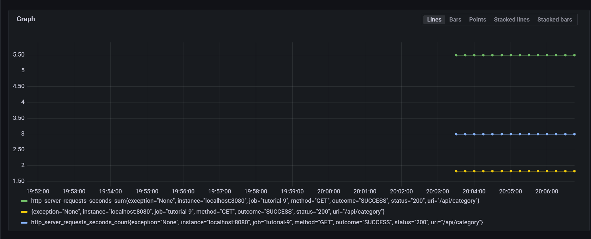

###Bagaimana mengatur Grafana agar menampilkan data Prometheus?
Pertama yang harus dipastikan adalah app-nya sudah terintegrasi dengan prometheus. Setelahnya, kita dapat mengimport JVM Micrometer Dashboard di grafana dan menggunakan datasource yang telah dibuat di prometheus sebelumnya. 

###Berdasarkan hasil Profiling yang anda dapatkan, jelaskan analisis anda terhadap keadaan aplikasi saat ini
Saat ini aplikasinya cukup baik, hanya saja salah satu bagian dari endpoint, yaitu api/category membutuhkan waktu yang cukup lama untuk diquery.

###Bagaimana anda mengintepretasikan temuan anda? Jelaskan dan berikan gambar screenshot setiap graph query yang anda dapatkan dari dashboard Prometheus dan Grafana

- Count artinya menunjukkan berapa kali endpoint itu dipanggil
- untuk melihat total second yang diperlukan dalam banyak request tersebut kita dapat menggunkaan SUM
- untuk melihat avg running timenya dapat di bagi  sum dengan count
